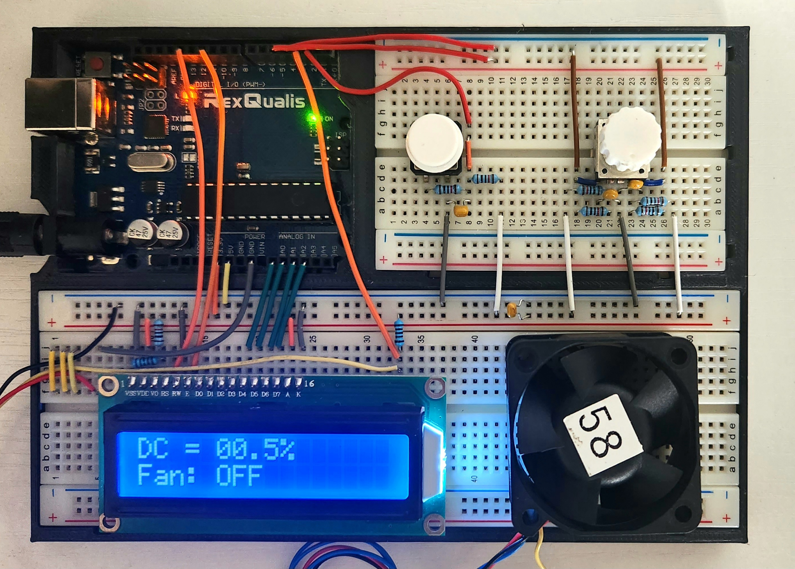

# Fa23 Embedded Systems Lab 4

### Mid-lab review (October 18):
Program successfully utilizes the LCD as well as an 8-bit timer/counter for PWM signal generation to adjust the fan speed.
### Mid-lab review (October 25):
Interrupt-driven interaction with RPG, PBS, etc. implemented.
### Deadline (November 1)
---

### Objective:
Gain some experience with advanced timer/counter functionality, pulse width modulation (PWM), interrupts, and LCDs.

### Description
Operate a cooling fan at different speeds with PWM. Utilize an RPG and a pushbutton (with suitable debounce circuits) as input, and an LCD as output. Use RPG input to modulate duty cycle (DC) of the PWM signal used to control the fan.

Fan off && PBS pressed -> Fan on  
Fan on && PBS pressed -> Fan off  
(Action occurs immediately on press down)

Fan off && RPG operated -> Do nothing  
Fan on && RPG CW -> Increase duty cycle  
Fan on && RPG CCW -> Decrease duty cycle  

Use 8-bit Timer/Counter Waveform Generation functionality for generating a PWM signal for the fan on pin OC0B.  
Fixed PWM frequency: 80kHz  
DC adjustable range: 1% <-> 100%  
DC adjustment increments: <= 1%  

Optional (5% bonus pts): Use tachometer signal to detect when fan is on/off and above/below 2640 rpm (44 Hz).

---

### LCD Formatting:
| **W/out Speed Monitoring** | **W/ Speed Monitoring** |
|:--- |:--- |
| DC = 78.5% Fan: ON | DC = 78.5% Fan: RPM OK |
| DC = 22.0% Fan: OFF | DC = 22.0% Fan: Stopped |
|  | DC = 3.0% Fan: LOW RPM |
|  | DC = 15.0% Fan: OFF |

---

### Circuit:

---

### Functionality:

